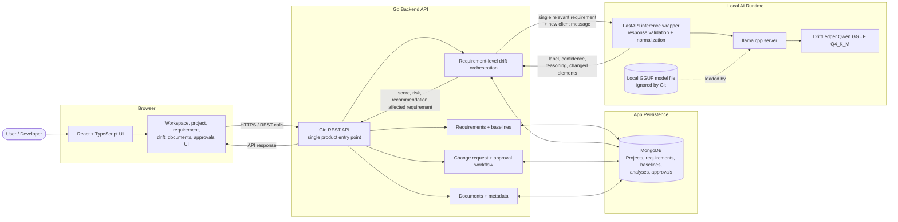

# Drift

Drift is a local-first SaaS workspace for detecting requirement drift before it turns into silent scope creep.

It helps a team compare new client messages or meeting notes against approved requirements, understand whether the scope actually changed, and turn material changes into approval-tracked change requests.

## Mission

Protect delivery teams from silent scope creep by turning changing client requests into clear, reviewable requirement-drift decisions before extra work becomes unpaid work.

## Vision

Make requirement change management feel less scattered: approved scope stays traceable, drift is explained, and every meaningful change can become an approval-ready decision instead of an informal chat message.

## Why This Exists

Most projects do not lose scope all at once.

They drift through small requests:

- "Can we also add this?"
- "Can this work a little differently?"
- "Can we remove this from the first version?"
- "Can another user role access this too?"

Each request can look harmless on its own. Over time, the approved baseline becomes blurry. Drift exists to make that change visible, explainable, and approvable.

## Product Workflow

```text
Create workspace
  -> Add project
  -> Add requirements
  -> Freeze a baseline
  -> Add new client message or meeting note
  -> Run drift analysis
  -> Review score, label, reasoning, and affected requirement
  -> Generate change request
  -> Approve, reject, or request revision
```

## What Drift Analysis Returns

The model-backed analysis compares one new client input against the approved baseline and returns:

- drift label: `added`, `modified`, `removed`, `contradiction`, `ambiguous`, or `unchanged`
- drift score and risk level
- confidence
- reasoning
- affected requirement
- changed elements
- estimated extra effort
- recommendation
- fallback/model status

Project-level analysis is requirement-aware: the backend compares the client input against relevant baseline requirements instead of blindly sending a whole project scope blob to the model.

## Core Features

- Workspaces and projects for organizing client work
- Requirement capture with effort, tags, source text, and acceptance criteria
- Baseline snapshots for approved scope
- Local model-backed drift analysis
- Saved analysis history
- Change request drafting from detected drift
- Approval queue with approve, reject, and revision decisions
- Document upload workflow
- Billing page placeholder for SaaS presentation
- Evaluation dashboard for local model quality checks

## AI Runtime

Drift uses a fine-tuned requirement-drift model path:

```text
Qwen2.5-7B + DriftLedger LoRA -> merged GGUF Q4_K_M -> llama.cpp
```

The local runtime is designed around a GGUF artifact:

```text
models/gguf/DriftLedger-Qwen2.5-7B-Q4_K_M.gguf
```

The original LoRA adapter was used to create the merged quantized artifact. Runtime inference uses the GGUF file through `llama.cpp`, with a FastAPI inference wrapper normalizing responses for the Go backend.

Large model files are intentionally ignored by Git.

## Architecture



The inference service is kept separate from the main backend so the product workflow and model runtime can evolve independently.
