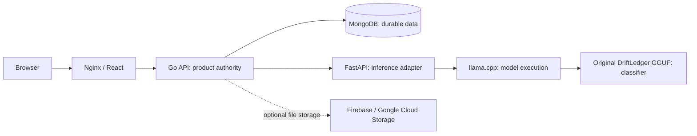

# Drift

## What Drift Is

Drift is a local-first workspace for comparing new client input with an approved requirements baseline. It helps a team identify possible requirement drift, review the evidence, and route material changes through an approval-tracked change-request workflow.

## Why It Exists

Requirements often change in messages and documents before project scope is updated. Drift keeps the approved baseline and the later evidence distinct, so people can review a proposed change instead of silently treating model output as a decision.

## System Architecture


```mermaid
flowchart LR
    Browser[Browser] --> UI[Nginx / React]
    UI --> API[Go API: product authority]
    API --> DB[(MongoDB: durable data)]
    API --> Inference[FastAPI: inference adapter]
    Inference --> Llama[llama.cpp: model execution]
    Llama --> GGUF[Original DriftLedger GGUF: classifier]
    API -. optional file storage .-> GCS[Firebase / Google Cloud Storage]
```

React owns presentation and temporary browser state. Go owns authorization, tenancy, persistence, and workflow transitions. MongoDB stores application data; FastAPI handles the prompt, response parsing, and normalization boundary; llama.cpp runs the model. The model does not own product state. See [architecture](docs/architecture.md).

## Core Components

- `client/`: React user interface and browser tests.
- `server-go/`: Gin API, product rules, authentication, tenancy, and MongoDB access.
- `services/inference/`: protected FastAPI adapter to an optional local model runtime.
- `models/gguf/`: ignored local GGUF artifacts; the original model remains the selected production/default artifact.

## Technology Stack

React, TypeScript, Vite, Playwright, Go, Gin, MongoDB, Python, FastAPI, llama.cpp, Docker Compose, and GitHub Actions. Google Cloud Storage is an optional file-storage integration.

## Request / Data Flow

The browser calls the Go API through Nginx. Go validates identity, tenancy, and product transitions before reading or writing MongoDB. When classification is requested, Go calls the internally protected FastAPI service, which constructs the prompt, invokes llama.cpp when configured, parses its output, and returns a bounded result. Go remains responsible for applying product rules. Optional file operations pass through Go to cloud storage.

## Requirement Drift Pipeline

An approved baseline and later client input form the comparison. The model supplies a proposed six-class label; parsing and validation occur at the inference boundary, while review, display, scoring, and change-request decisions remain application concerns. The current runtime still uses a historical four-field JSON response contract (`label`, `confidence`, `reasoning`, `changed_elements`); the label-only architectural conclusion has **not** been migrated into the production API. See [model research status](docs/model_research_status.md).

## Security Model

Browser and model output are untrusted. The Go API is the authorization boundary; the inference API requires an internal key, and required JWT/key settings fail closed. Docker's default local stack is not a hardened public deployment. See [security](docs/security.md) and [configuration](docs/configuration.md).

## Testing Strategy

`make verify` is the local software check. Mongo-backed integration tests and Playwright E2E tests are separate commands; model smoke/evaluation runs are separate from ordinary verification. CI defines the authoritative job composition. A passing local subset is not a staging sign-off. See [verification](docs/verification.md) and the [staging gate](docs/staging_readiness_gate.md).

## Model Strategy

Phase III research is frozen. Keep the original GGUF as the selected production/default model. The Phase III-J label-only candidate failed its development screen and is a research artifact only; Phase III-K calls for new independent data before further tuning. The sealed final holdout remains unused. No retraining or model replacement is authorized by this README. See [model research status](docs/model_research_status.md).

## Local Development

Prerequisites: Node.js 22, Go 1.26.9, Python 3.13+, and Docker Compose. Copy `.env.example` to `.env` and set independent `JWT_SECRET` and `DRIFT_INFERENCE_API_KEY` values of at least 32 characters. Never commit `.env`.

```bash
cp .env.example .env
make setup
make run
make verify
```

The default Compose stack serves the UI at `http://localhost:5173` and starts MongoDB, FastAPI, and Go; it does **not** start llama.cpp or load model weights. See [development setup](docs/development.md) for component commands and prerequisites.

## Repository Structure

`client/`, `server-go/`, and `services/` are application code; `tools/` contains verification and model/research utilities; `evaluation/` holds tracked contracts and evidence metadata; `docs/` holds engineering guidance and historical decisions. `models/` and `archive/` also contain ignored local binaries and private evidence. Generated output, `.env`, local model weights, and private archives must stay out of Git and Docker build contexts.

## Deployment Overview

The repository defines a single-host Docker Compose topology, an optional GPU override, and a separate [proposed staging overlay](docs/staging_configuration.md) that passed local configuration checks. It is **not** a proven staging or production platform: no staging deployment, live TLS/ingress validation, or target-host rollback rehearsal has occurred. A local synthetic A→B→A rollback did pass. See the [Phase IV-C release-blocker report](docs/phase_iv_c_release_blocker_remediation.md) before any staging work.

## Project Status

The existing application is under repository consolidation. Model research is frozen; the original model is retained, and the Phase III-J candidate is rejected. Staging is **not ready** under the [objective gate](docs/staging_readiness_gate.md). No deployment is implied by local test results.

## Known Limitations

The four-field inference contract predates the label-only research conclusion. Some historical research documents describe now-superseded proposals. Local Compose defaults are not equivalent to a secured deployment; despite passing isolated local E2E and Mongo restore tests, external storage, target-host recovery, remote CI, and rollback still require staging-level verification. See [known limitations](docs/known-limitations.md).

## Engineering Decisions

The Go API remains the product authority, while model output is advisory. The repository preserves frozen research evidence instead of rewriting history. See [architecture decisions](docs/decisions/), the [Phase IV-A baseline](docs/phase_iv_a_repository_and_release_readiness.md), the [Phase IV-B assessment](docs/phase_iv_b_release_candidate_readiness.md), and the current [Phase IV-C report](docs/phase_iv_c_release_blocker_remediation.md).

## Documentation

Start with the [documentation index](docs/README.md) for architecture, setup, security, tests, operations, model status, and historical evidence.
